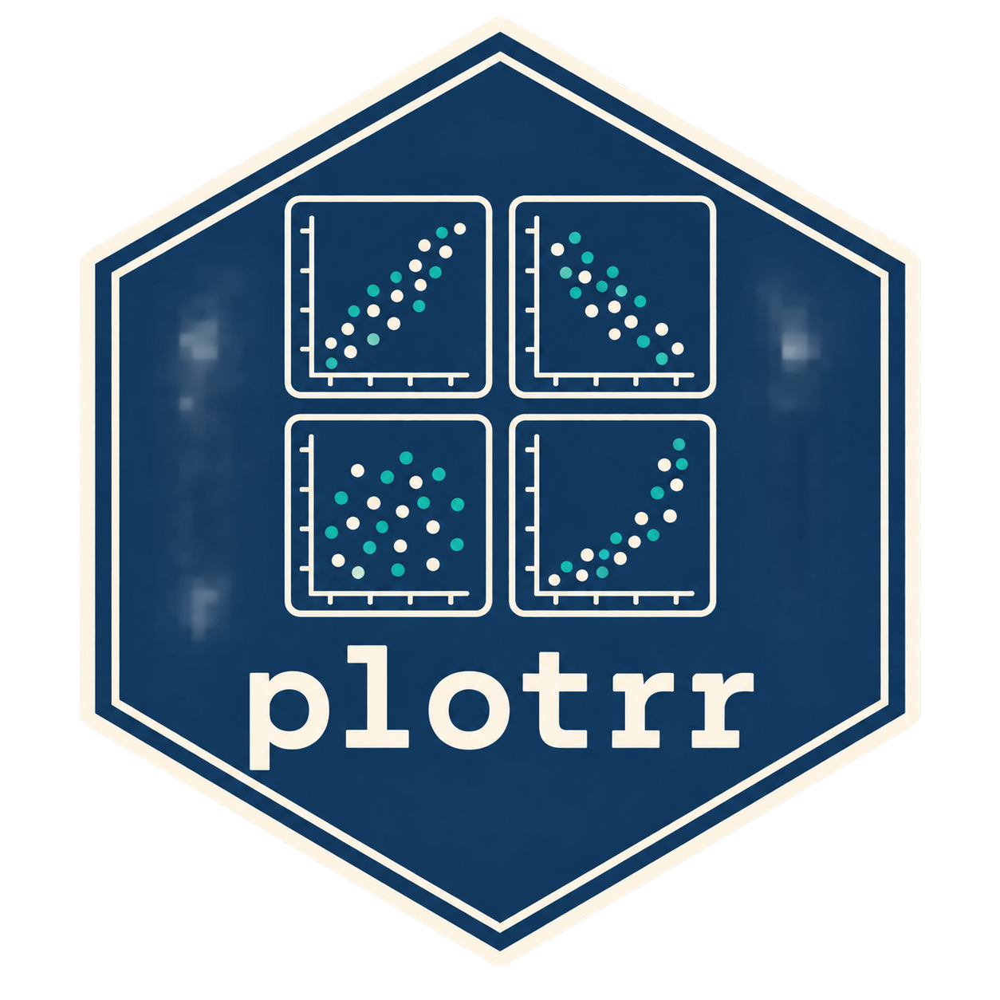

[](https://thelatentreview.com/provenance/)

[](https://CRAN.R-project.org/package=plotrr)
[](https://CRAN.R-project.org/package=plotrr)
[](https://zenodo.org/badge/latestdoi/80883292)
[](https://doi.org/10.21105/joss.00190)

# plotrr: Functions for making visual exploratory data analysis with nested data easier <a href="https://lobsterbush.github.io/plotrr/"></a>

[Package documentation](https://lobsterbush.github.io/plotrr/) · [Function reference](https://lobsterbush.github.io/plotrr/reference/index.html)

We built `plotrr` to make it easier to look at relationships within groups.
A pattern in pooled data can look quite different when you examine each
country, school, or respondent separately.

Exploratory data analysis helps us see what our data contain before fitting a
model (Tukey 1977). It can reveal unusual observations and assumptions that
need another look (NIST/SEMATECH 2012). With nested data, we want to do that
within groups as well as across the whole sample.

As demonstrated in Crabtree and Nelson (2017), these plots can help us assess
whether the relationships we expect appear in particular cases. They give us
something concrete to investigate; they don't establish a causal explanation.

`bivarplots()` draws a scatterplot for each group. `histplots()` and
`dotplots()` show a variable's distribution within each group, while
`violinplots()` compares distributions across values of another variable.
`bivarrugplot()` adds marks along the axes to show where observations lie.

The package also includes a few small helpers. `lengthunique()` counts distinct
non-missing values, `makefacnum()` converts numeric factor labels to numbers,
and `clear()` prints a form-feed character to the console.

Authors: Charles Crabtree and Michael J. Nelson.

## Installation

Install the stable version from CRAN:

```r
install.packages("plotrr")
```

Or install the development version from GitHub:

```r
if (!require("remotes")) install.packages("remotes")
remotes::install_github("lobsterbush/plotrr")
```

## Help and contributions
Please use the [issue tracker](https://github.com/lobsterbush/plotrr/issues) for problems, questions, or feature requests. If you would rather email with questions or comments, you can contact [Charles Crabtree](mailto:charles.crabtree@monash.edu).

We welcome pull requests. If you're unsure where to start, open an issue and tell us what you'd like to change.

## Tests
Start with the examples in the function help. They use simulated data, so you can run them without downloading a dataset.

## Thanks
Thanks to [Karl Broman](https://github.com/kbroman) and [Hadley Wickham](https://hadley.nz/) for providing excellent free guides to building R packages.

### References
- Trochim, William M. K., and James P. Donnelly. 2008. _Research Methods Knowledge Base_. New York, NY: Cengage Learning.


## Documentation and provenance

Browse the [documentation and function reference](https://lobsterbush.github.io/plotrr/).

**Human – AI (editor) 👤✏️🤖**

We wrote every initial version ourselves, without AI. We've used AI only for
later updates and code fixes. I'm Charles Crabtree, and this is my account of
how the package was made.

The label follows [The Latent Review’s provenance standard](https://thelatentreview.com/provenance/),
shared under [CC BY 4.0](https://creativecommons.org/licenses/by/4.0/).
The software remains MIT licensed.

## Build the documentation

Install R and the package dependencies listed in `DESCRIPTION`, then install
`pkgdown` and `here`. From the repository root, run:

```r
source(here::here("data-raw", "01_build_site.R"))
```

The site is built locally in `docs/`. Publish the rendered contents to the
`gh-pages` branch; GitHub Pages serves that branch.
